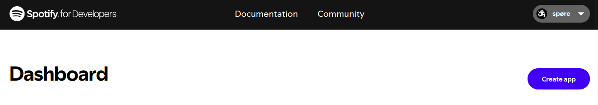
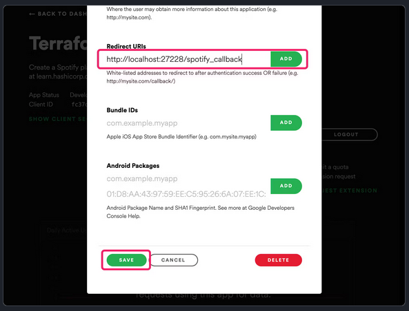
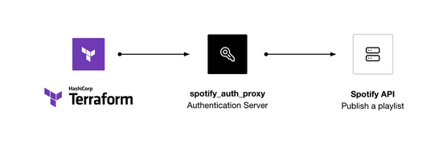
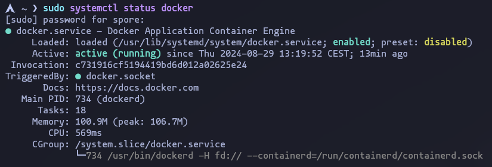
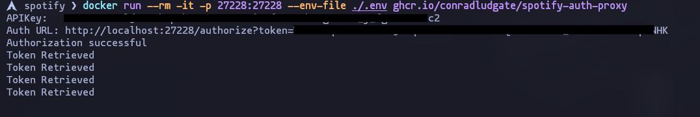
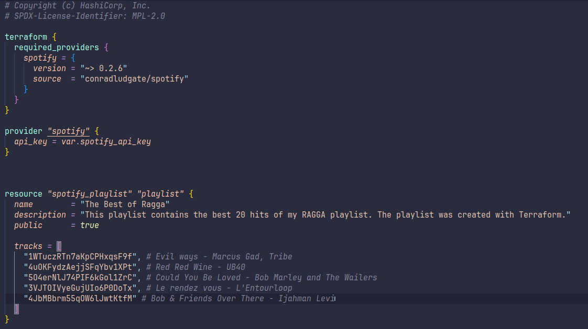
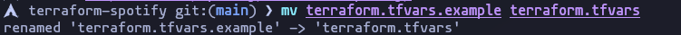
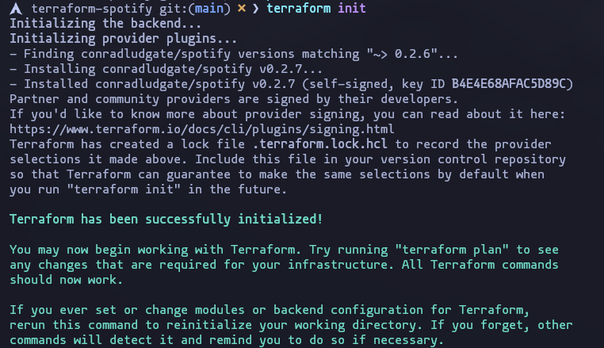
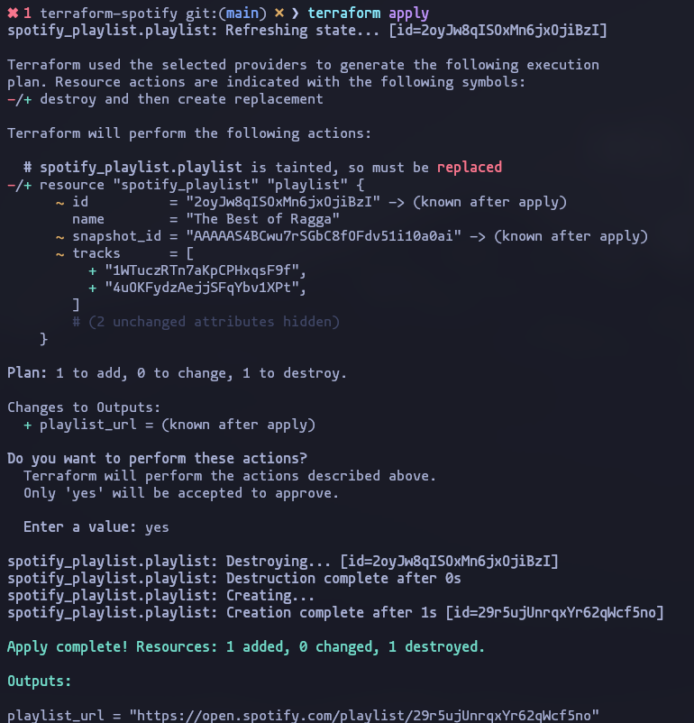
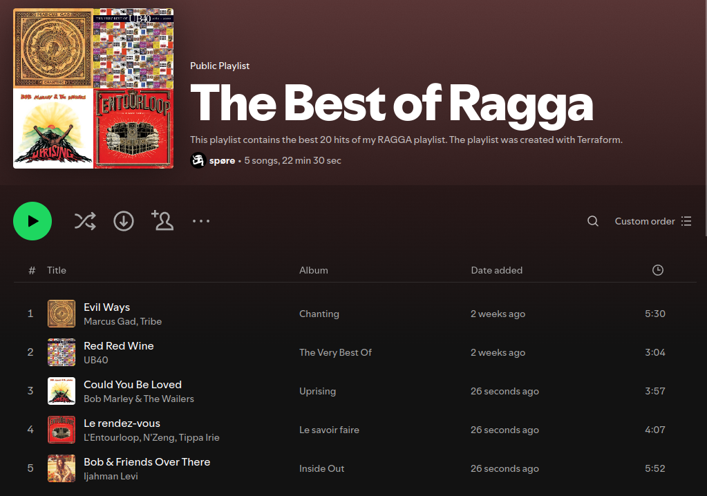

# Create a Spotify Playlist with Terraform
I used Terraform data source to search Spotify tracks and use that data to build a playlist.

## Prerequisites
You will need:

- **Terraform:** version 1.0+
- **Docker**
- **Spotify account with developer access**


## Create Spotify developer app
Before you can use Terraform with Spotify, you need to create a Spotify developer app.

<div align="center">
    
</div>


Click on Create App and Fill out the name and the description according to your needs.

Once Spotify creates the app click on *Edit Settings*.

Copy the URI below into the *Redirect URI* field and click Add so that Spotify can find its authorization app on port 27228 at the correct path


```sh
http://localhost:27228/spotify_callback
```


<div align="center">
    
</div>


## Run authorization server
Now that oyu created the Spotify app, we have to configure and start the athorization server proxy, which allows Terraform to interact with Spotify.

<div align="center">
    
</div>

In you terminal, you will need to set the redirect URI as an eviroment variable:

```sh
$ export SPOTIFY_CLIENT_REDIRECT_URI=http://localhost:27228/spotify_callback
```

Then we need to create the .env with the following contents to store your Spotify application's client ID and secret. You can find your credentials in the playlist's settings in your spotify developer account.

```sh
SPOTIFY_CLIENT_ID=
SPOTIFY_CLIENT_SECRET=
```

Make sure that you have Docker running, you can check it (if your distro have systemd service) with:

```sh
$ sudo systemctl status docker
```

<div align="center">
    
</div>

In the sad case that you are using Windows, I guess you will have to make sure that Docker Desktop is running.


Then you need to run the container:

```sh
$ docker run --rm -it -p 27228:27228 --env-file ./.env ghcr.io/conradludgate/spotify-auth-proxy
```

<div align="center">
    
</div>

Visit the AUTH url link and the server will redirect you to Spotify to autheticate. After authenticate, teh server will display **Authorization successful**, indicating that the Terraform provider can use the server.

We have to leave the server running.

## Clone the repository

The next step is to clone the repository with the example configuration and then test and experiment with it.


```sh
$ git clone https://github.com/hashicorp/learn-terraform-spotify.git
```

## Configuration

The **main.tf** contains the Terraform configuration that searches Spotify and creates the playlist. 

<div align="center">
    
</div>

The two first blocks configure Terraform itself and specify the community provider that Terraform uses to comunicate with Spotify and configure the Spotify provider with the key you set as a variable.

The resource block creates a playlist with the name and description provided and the track in the list with the *track id*.

>[!NOTE]
> This version of **main.tf** is a modified version by me, not the default version that you will see when you clone the repo for first time.

## Set the API key

We have to rename the file **terraform.tfvars.example** to **terraform.tfvars** so that Terraform can detect the file.

<div align="center">
    
</div>

The **.gitignore** file in this repository excludes files with the **.tfvars** extension from version control to prevent you from accidentally committing your credentials.

>[!CAUTION]
> Never commit sensitive values to version control.

You will have to take the **APIKey** in the Spotify authorization proxy and replace the ... with it in the **terraform.tfvars**, so that Terraform can authenticate with Spotify.

### Install the Spotify provider

In the terminal, we have to initialize Terraform, which will install the Spotify provider.

<div align="center">
    
</div>

## Create the playlist

Now to create the playlist we have to apply our Terrform configuration. Terraform will show the changes and prompt for your approval.

<div align="center">
    
</div>

*In the image we can see how I already had the playlist made, and what I am doing is applying some changes.*

Now we have our playlist in Spotify!

<div align="center">
    
</div>